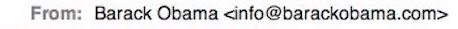
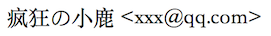
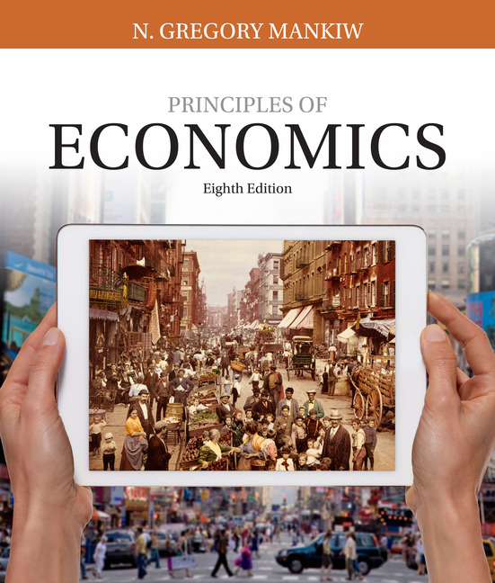
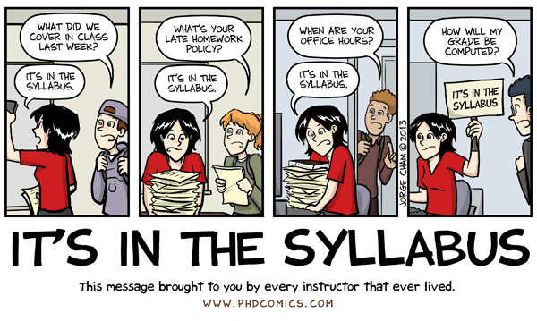

```{r setup, include=FALSE}
options(htmltools.dir.version = FALSE)
library(knitr)
opts_chunk$set(
  fig.align="center",  
  fig.height=4, #fig.width=6,
  # out.width="748px", #out.length="520.75px",
  dpi=300, #fig.path='Figs/',
  cache=T#, echo=F, warning=F, message=F
  )
library(tidyverse)
library(hrbrthemes)
```

# General Information

Course website: 

<div style="text-align:center"><a href="https://jiamingmao.github.io/principles-of-economics">https://jiamingmao.github.io/principles-of-economics</a></div>

- Github repo: https://github.com/jiamingmao/principles-of-economics

- Homework submission: http://l.xmu.edu.cn (SPOC; pw: raven)

Course materials are continually updated and posted to the website and the Github repository. It is recommended that you clone the repo and pull regularly to get updates (here is information on  [how](https://jiamingmao.github.io/principles-of-economics/Software)).

---

# Teaching Staff

**Instructor**

- Jiaming Mao

    - Office: D303 Economics Building
    - Office Hour: Tue 2:00 - 4:00 pm or by appointment
    - Email: [jmao@xmu.edu.cn](Emailto: jmao@xmu.edu.cn)
    
- Zhengyang Bao

    - Office: D215 Economics Building
    - Office hour: Mon 3:00 - 5:00 pm or by appointment
    - Email: [zhengyangbao@gmail.com](Emailto: zhengyangbao@gmail.com)
    
**Assistant**

- Zichao Li

    - Email: [lzc563236@gmail.com](Emailto: lzc563236@gmail.com)

---

# Time and Location

**Class**

- Time: Tue, 8:00 - 9:40 AM; Thu, 10:10 - 11:50 AM

- Location: SouthStrong 301

**Review** 

- Time: TBD

- Location: TBD

---

# Review Session

- We will have weekly review sessions.

- Each review session consists of two halves: 

    - The first half will be a mini-lecture on supplementary materials and topics of interest. In-class experiments will also be conducted during which you will play games that mimic real economic settings, such as [trading in competitive markets](https://www.moblab.com/edu/games/competitive-market-continuous-double-auction). The goal is to facilitate learning and encourage you to think on a deeper level how economic theory works or fails to work in practice.
    
    - The second half will be a Q&A session on course materials and homework problems.
    
- Review sessions are an important extension of our class. Attendance is not mandatory, but highly encouraged. You will also have the opportunity to earn bonus credits. 

---

# Communication

- You can reach me by email or wechat.

- When sending an email, make sure the sender name is your real full name.

    - This is good:<br>
    
    - This is not so good:<br>
    
    - It is more professional to use your university email address: <yourname@xmu.edu.cn>
    
- In communications, feel free to address me by first name, i.e. "_Jiaming_" instead of "_Prof. Mao_"

---

# Textbook

```{r, out.width = "400px", echo=FALSE}

```
<p></p>
<div style="text-align:center">Mankiw, G., <a href="https://www.amazon.com/Principles-Economics-Mankiws/dp/1305585127">Principles of Economics (8e)</a></div>

---

# Evaluation

<br>
<br>
<br>

Final Grade | 100%
-------- | -------
Midterm Exam | 30%
Final Exam | 30%
Homework | 40%

<br>

- For details, see [final grade calculation](https://github.com/jiamingmao/principles-of-economics/blob/master/Course%20Info/Final_Grade_Calculation.pdf). 

---

# Homework

- Homework assignments are submitted on [SPOC](http://l.xmu.edu.cn).

- You are encouraged to discuss homework with your classmates, but must prepare yours *individually*.

- Economics is an empirical science. Even though this is an introductory course, we will be conducting some hands-on data analysis in our homework to help us apply and better understand the principles and theories we learn in class.

- We will be using a statistical computing language called `R`. See [here](https://jiamingmao.github.io/principles-of-economics/Software/) for an introduction and helpful resources.

- It is recommended that you write your homework in `LaTeX` or `markdown`. When we do data analysis, it is _mandatory_ that you write your homework in `R markdown`, which allows you to embed `R` codes in the homework and automatically generate their output.

---

# Recommended Readings

- In addition to classroom learning, it is important that you culitvate the habit of reading and following economic and financial news.

  - Wall Street Journal (WSJ), Financial Times (FT), Bloomberg, The Economist, ...
  
- For more in-depth reading, I also recommend publications such as the Journal of Economic Perspectives, where economists publish non-technical articles on various topics in economics and finance.

- See [here](https://jiamingmao.github.io/principles-of-economics/Links) for a list of these and other recommended readings.

---

# More Information

For more information, check out the official [syllabus](https://jiamingmao.github.io/principles-of-economics/assets/syllabus.pdf) and our [course repo](https://github.com/jiamingmao/principles-of-economics). 

