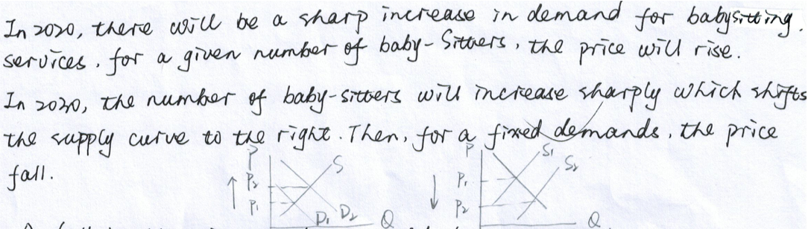
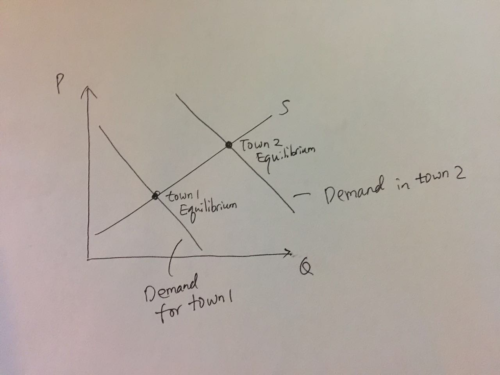
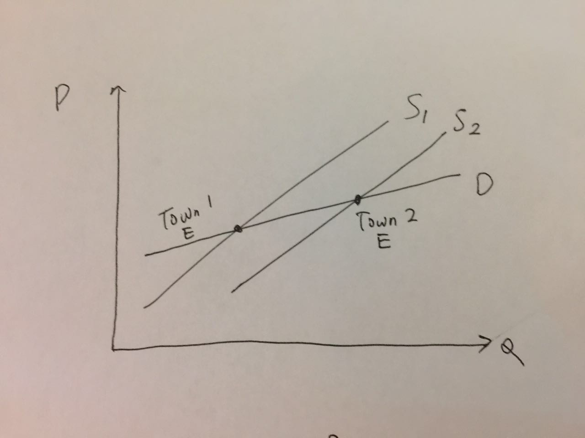
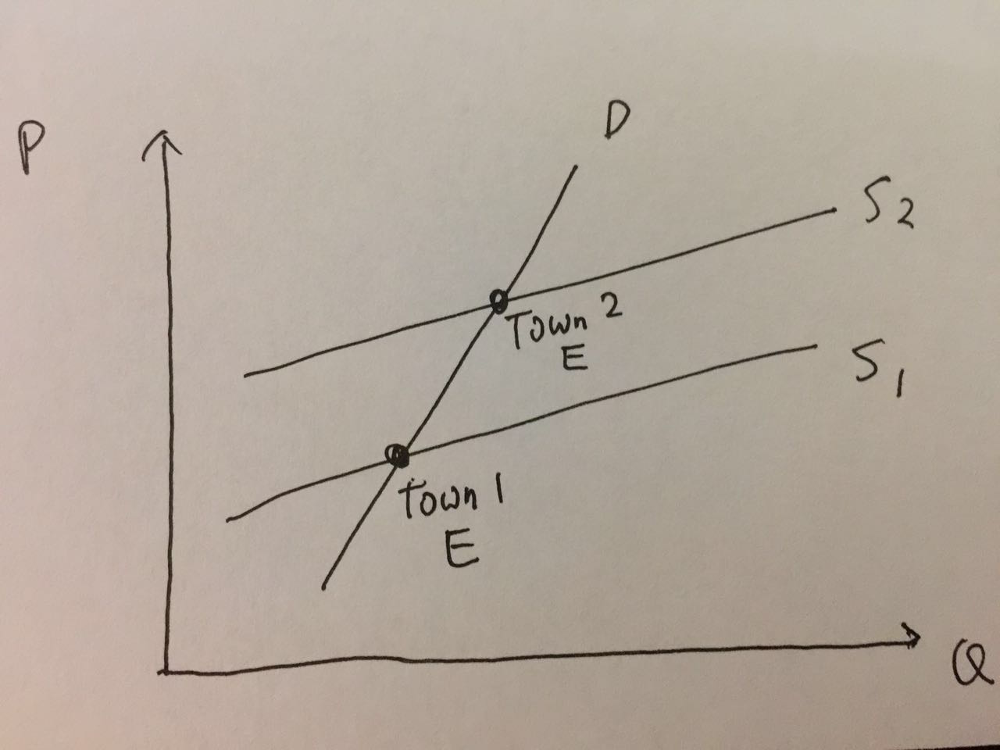

---
output:
  pdf_document: default
  html_document: default
---
# Homework 3
### Suggested Solutions
## Problem 1
The following answers assume that we draw supply and demand curves with price on the y-axis and quantity on the x-axis.

(a) Supply shifts to the left. $P^{e}\uparrow,Q^{e}\downarrow$
(b) Demand shifts to the right. $P^{e}\uparrow,Q^{e}\uparrow$
(c) Demand shifts to the left. $P^{e}\downarrow,Q^{e}\downarrow$
(d) Demand shifts to the right. $P^{e}\uparrow,Q^{e}\uparrow$

## Problem 2

## Problem 3

## Problem 4

## Problem 5
The author presents the following evidence in support of his claim that children are inferior goods:
1. Across countries, countries with higher GDP/capita have fewer children per woman.
2. Across time, as countries get richer, they have fewer children per woman.
3. Within a country, rich people have fewer children than poor people.

A problem with this analysis is that as countries and people get richer, other things change:

Most importantly, the cost of raising children becomes higher, i.e. people demand fewer children when the "price of children" is high.
- How about evidence 3 - within a country, richer people have fewer children? Even within a country, the cost of raising children is not uniform. Richer people tend to live in more expensive cities where the cost of raising children is high, which could explain the fact that they have fewer children.

In addition to cost, the benefit of having children also changes. In poor countries, the welfare and the financial systems are weak. People enjoy little social safey net and have limited access to credit and savings technology. As a result, children become a form of savings and provide safety net for old age. Such benefit disappears when a country becomes richer and develops stronger welfare and financial systems.
- The same reasoning applied to richer and poorer people within a country. Richer people have better access to credit and savings technology and need to rely less on the family.
- This also explains why traditional family relations tend to break down in advanced economies.

In summary, in order for children to be an inferior good, people have to want fewer children when they become richer, _other things being equal_ (i.e., while other things do _not_ change). In reality, multiple other things change (both the cost and benefit of raising children) that could explain why people have fewer children when they are richer. Hence evidence 1-3 may not be conclusive evidence of children being an inferior good.

## Problem 6
- The rise in oil price from 2002 to 2008 was mainly due to increased demand from emerging economies, especially China.
- The collapse from July 2008 to Feburary 2009 was due to decreased demand as a result of the global financial crisis. Oil prices rebounded after 2009 as world economies started to recover.
- The fall in oil price from 2014 to 2016 was mainly due to increased supply from the U.S. (shale oil) and the middle east.

## Problem 7
**Scenario 1**: Economics as Usual

---

**Scenario 2**: Giffen Behavior

---

If we only observe data on rice price and consumption in different towns, then we cannot differentiate between scenario 1 and 2. Both can explain the positive correlation between price and consumption (if exists). To make sure it is scenario 2, we need to make sure that the demand curve does not move. That’s why Jensen and Miller use experimental methods to discover Giffen behavior: by giving people subsidies, they are able to change the prices that people face without changing their demand.

## Problem 8

## Problem 9
1. $p^c = 172,q^c=182,p^o=26,q^o=154$
2. substitutes
3. $p^c = 153,q^c=218,p^o=24,q^o=146$

