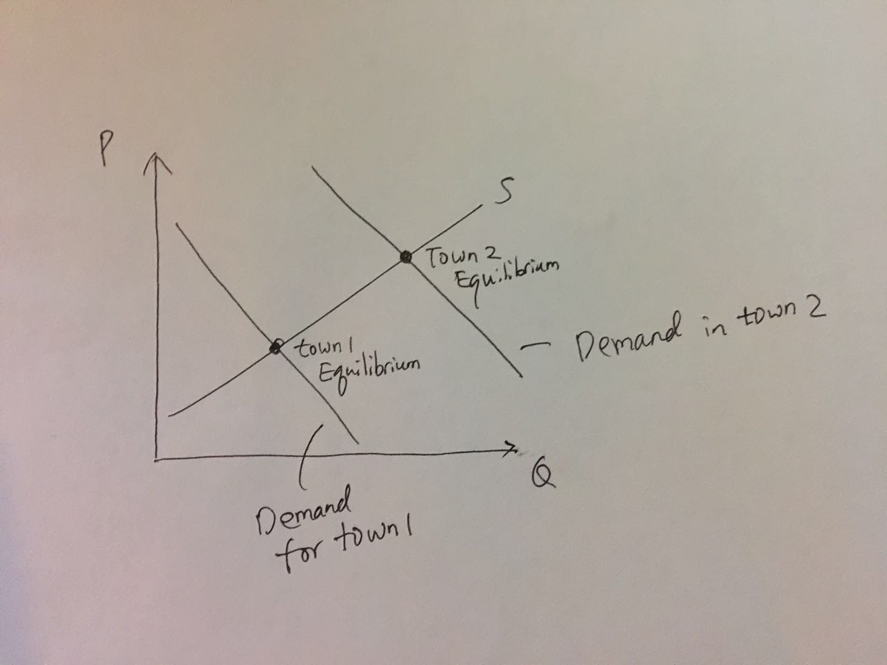
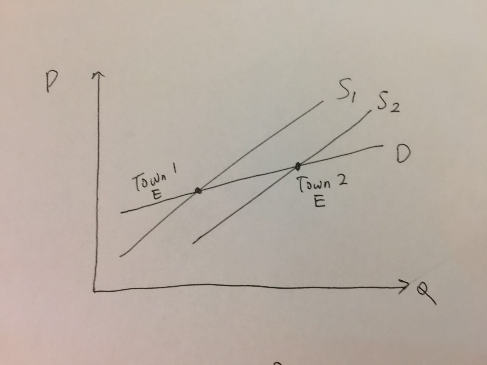
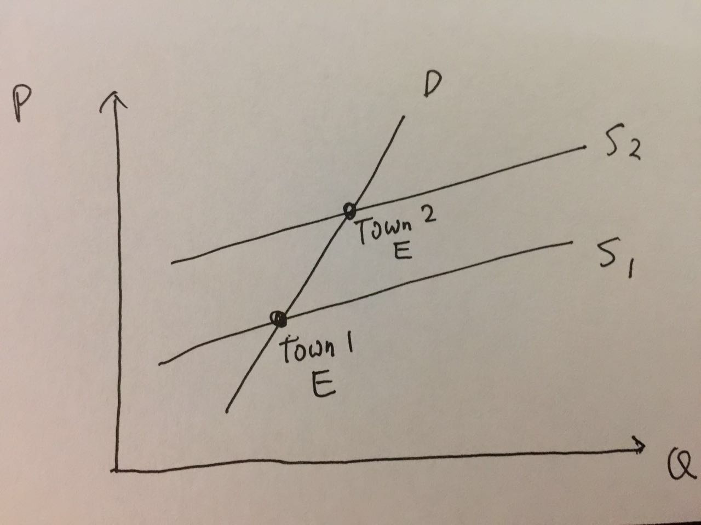

```{r setup, include=FALSE}
knitr::opts_chunk$set(echo = TRUE)
rm(list = ls()) 
```

## Problem 1
**Scenario 1**: Economics as Usual



---

**Scenario 2**: Giffen Behavior





---

If we only observe data on rice price and consumption in different towns, then we cannot differentiate between scenario 1 and 2. Both can explain the positive correlation between price and consumption (if exists). To make sure it is scenario 2, we need to make sure that the demand curve does not move. That’s why Jensen and Miller use experimental methods to discover Giffen behavior: by giving people subsidies, they are able to change the prices that people face without changing their demand.

---

## Problem 2

### 2.1

```{r}
p1 = 0:100
p2 = 50
I = 100
q1 = 1000 - 10*p1 + 5*p2 + 2*I
plot(p1,q1,type="l",col="brown",main="Own Price and Demand",ylim=c(0,1500))
```

### 2.2

```{r}
p1 = 50
p2 = 0:100
I = 100
q1 = 1000 - 10*p1 + 5*p2 + 2*I
plot(p2,q1,type="l",col="brown",main="Price of Related Goods and Demand",ylim=c(0,1500))
```

### 2.3

```{r}
p1 = 50
p2 = 50
I = 0:100
q1 = 1000 - 10*p1 + 5*p2 + 2*I
plot(I,q1,type="l",col="brown",main="Income and Demand",ylim=c(0,1500))
```

### 2.4

```{r}
p2 = 50
I = 100
p1 = 0:(1000 + 5*p2 + 2*I)/10
q1 = 1000 - 10*p1 + 5*p2 + 2*I
plot(q1,p1,type="l",col="brown",main="Demand Curve")
p2 = 10
I = 100
p1 = 0:(1000 + 5*p2 + 2*I)/10
q1 = 1000 - 10*p1 + 5*p2 + 2*I
lines(q1,p1,col="cornflowerblue")
p2 = 50
I = 200
p1 = 0:(1000 + 5*p2 + 2*I)/10
q1 = 1000 - 10*p1 + 5*p2 + 2*I
lines(q1,p1,col="burlywood")
legend("topright", legend=c('p2=50,I=100','p2=10,I=100','p2=50,I=200'),lty=1,
       col=c("brown","cornflowerblue","burlywood")) 
```

### 2.5
normal

### 2.6
substitutes

---

## Problem 3

### 3.1, 3.2

```{r}
data <- read.csv('CEdiary_201501.csv')
data <- data[data$FINCBEFX>0 & data$FOODTOT>0,]
income <- data$FINCBEFX
food <- data$FOODTOT
plot(income,food,col="cornflowerblue",ylab="food expenditure")
abline(lm(food~income),col="red")
```

### 3.3

Based on this data alone, we cannot conclude definitely whether food is normal. The definition of a normal good is that quantity demanded $Q$ increases with income $I$ (other things being equal [^1]), whereas the data show that expenditure, which is $P\times Q$, increases with $I$.

It is possible for food expenditure to increase with $I$ while food is actually inferior. Consider this scenario: people with higher income tend to live in more expensive cities. In more expensive cities, the cost of supplying food is higher (higher rent, higher labor cost, etc). Thus even if food is inferior, so that higher income people want to buy less food, they may still end up spending more on food because food is more expensive in the places where they live. Thus we could observe a positive correlation between food expenditure and income even when food is inferior [^2]. 

[^1]: "Other things being equal” means that “when other determinants of Q do not change.”
[^2]: Of course, this scenario is theoretically possible but unlikely: in reality, we observe the same positive correlation between income and food expenditure everywhere, whether in more expensive cities or inexpensive rural areas.

---

## Problem 4

### 4.1, 4.2

```{r}
oildata <- read.csv('MCOILWTICO.csv')
corndata <- read.csv('PMAIZMTUSDM.csv')
oil <- ts(oildata[,2],start=c(1990,1),freq=12)
corn <- ts(corndata[,2],start=c(1990,1),freq=12)
plot(oil,xlab="",ylab="",col="darkorange",ylim=c(0,350))
lines(corn,col="cornflowerblue",ylim=c(0,350))
legend("topleft", legend=c('corn ($/mt)',' oil ($/ba)'),lty=1,col=c("cornflowerblue","darkorange")) 
```

### 4.3

```{r}
plot(corn,oil,col="cornflowerblue")
abline(lm(oil~corn),col="red")
```

### 4.4

```{r}
cor(corn,oil)
```

### 4.5

Corn and crude oil are _more likely_ to be substitutes because their prices are positively correlated (i.e. their prices tend to rise and fall together).

### 4.6

There are other possibilities that may cause the prices of corn and crude oil to move together. One such possibility is change in people's income. When people's income rises, they demand both more ethanol/corn and more gas/crude oil [^3], and when their income falls [^4], they demand less of both. This has nothing to do whether corn and crude oil are substitutes or not, but can lead their prices to rise and fall together.

Another possibility is that the price of oil can affect the cost of supplying corn and vice versa, since both are used to produce fuel for transportation. Yet another (theoretical) possibility is if the costs of supplying corn and crude oil are positively correlated themselves. In that case their prices will be positively correlated too, other things being equal.

### 4.7

We need to know that when the price of crude oil rises [^5], nothing changes for the corn market other than this increase in oil price and that gas price does not significantly affect the cost of supplying corn. In this case, if we observe an increase in corn price, we can conclude that it is because corn and crude oil are substitutes (in fuel production). Similarly, when the price of corn rises, if the only thing that has changed for the market of crude oil is the corn price, and we observe an increase in oil price, then we can conclude that they are substitutes. 

[^3]: For example, China's economic growth has led to a significant increase in global demand for both commodities.
[^4]: such as after the financial crisis of 2008.
[^5]: due to supply and/or demand shifts as a result of changes in factors such as income and cost.